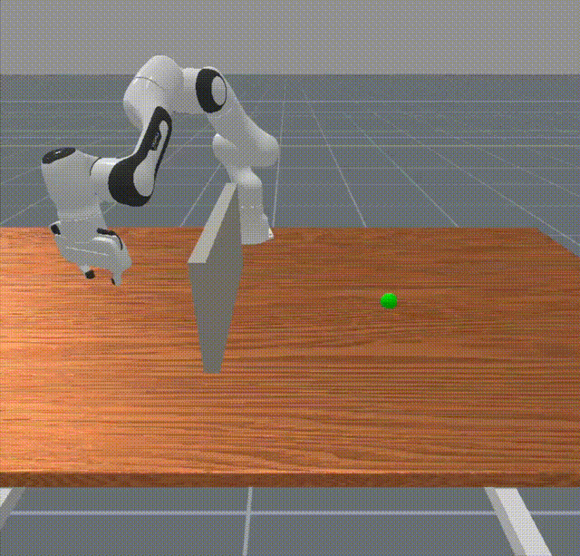

# Closed-Loop Controller Evaluation — ReachGoal

Closed-loop arm of the COSC 540 *Red-Teaming the Robot* project.
LLM-generated adversarial scenarios are rolled out in
[ManiSkill3](https://github.com/haosulab/ManiSkill) against a Franka Panda
manipulator running a PD + Waypoint + Potential-Field controller, and a
runtime safety monitor records every constraint violation.

This directory complements the offline scene-generation arm at the repo
root (`llm_generator.py`, `validator.py`, `metrics.py`) by adding
ground-truth violation rollouts on a custom `ReachGoal` task with a
controller-specific six-knob attack surface.

## Directory Layout

```
closed_loop/
├── README.md
├── requirements.txt              # closed-loop-arm dependencies (ManiSkill3, gymnasium, …)
├── constraints.yaml              # safety constraints + adversarial parameter ranges
├── run_experiment.py             # main experiment loop (single / full / baseline / compare)
├── run_comparison_study.py       # batch LLM-vs-random study; emits study_output/
├── env/
│   ├── franka_reach_obstacle.py  # custom ManiSkill3 env (FrankaReachObstacle-v0)
│   └── obstacle_builder.py       # obstacle geometry helpers
├── controller/
│   └── pd_ee_controller.py       # PD + waypoint + potential-field controller (system under test)
├── modules/
│   ├── safety_monitor.py         # per-timestep constraint checker → Violation records
│   ├── adversarial_generator.py  # Claude-based scenario generator (closed-loop schema)
│   ├── root_cause_analyzer.py    # heuristic + optional LLM subsystem attribution
│   └── experiment_logger.py      # structured per-episode logging
├── scenarios/                    # YAML scenario presets (hand-crafted + LLM-generated)
│   └── llm_preset/               # 35 LLM-generated ReachGoal scenarios (ep01..ep35)
├── results_llm/llm_results.json       # 35-episode LLM rollout output
├── results_random/random_results.json # 100-episode random-baseline rollout output
└── study_output/
    ├── comparison_summary.csv    # aggregate metrics consumed by §7 of the report
    └── figures/                  # overall_metrics, per_constraint_rates,
                                  # subsystem_attribution, time_to_failure
```

## Setup

```bash
conda create -n redteam python=3.9
conda activate redteam
pip install -r requirements.txt
python -c "import mani_skill; print('ManiSkill OK')"
```

## Running

```bash
# Single hardcoded scenario (debug, no LLM)
python run_experiment.py --mode single

# Same, with GUI
python run_experiment.py --mode single --render

# Run a YAML preset
python run_experiment.py --mode single \
    --scenario scenarios/obstacle_proximity_test.yaml

# Full LLM adversarial sweep (uses Anthropic Claude)
python run_experiment.py --mode full --episodes 100 \
    --api-key $ANTHROPIC_API_KEY

# Random-uniform baseline over the same parameter bounds
python run_experiment.py --mode baseline --episodes 100

# Side-by-side LLM vs random (writes results_llm/, results_random/)
python run_experiment.py --mode compare --episodes 50

# Reproduce the comparison study used in the final report
python run_comparison_study.py
```

The Anthropic API key is read from `--api-key` or the `ANTHROPIC_API_KEY`
env var. The top-level `api_key.py.example` of the parent repo can be
adapted if you want to share keys across arms.

## Task: ReachGoal

A Franka Panda arm is placed in front of a thin wall obstacle with a
green goal sphere on the far side. The end-effector starts on the near
side and must climb over the wall to reach the goal.

**Wall geometry and goal pose are fixed across scenarios** — only the
controller parameters and the EE start position are adversarial, which
isolates the controller's behaviour as the system under test.
The clean baseline reaches the goal in ~600 steps with zero violations:



*Clean baseline rollout — full-quality
[MP4 download](../assets/reachgoal_task_successful.mp4).*

```
EE start         wall          goal
(y ≈ -0.41)     (y = 0.0)    (y = 0.40)
    x        ── | ──            o
    |←  0.41 m →|←  0.40 m  →|
```

## Controller Under Test: PD + Waypoint + Potential Field

Three-phase Cartesian end-effector controller in
[`controller/pd_ee_controller.py`](controller/pd_ee_controller.py):

1. **Climb phase** — target a waypoint above the wall (wall top + clearance).
2. **Switch** — guard condition fires once the (possibly noisy) EE pose
   indicates the arm has cleared the wall top.
3. **Reach phase** — target the true goal pose.

In every phase the commanded Cartesian delta is the sum of an attractive
PD term and a repulsive term from the potential field that activates only
when the EE is within `influence_distance` of the wall. The Cartesian
delta is mapped to joint deltas via the damped pseudoinverse of the
analytical position Jacobian computed from the Panda DH parameters at
the current joint configuration.

### Six adversarial knobs

Bounds loaded at run time from [`constraints.yaml`](constraints.yaml):

| Knob | Bounds | Failure mode it enables |
|---|---|---|
| `ee_start.y` | `[-0.68, -0.06] m` | Biases the climb trajectory |
| `sensor_noise.ee_position_std` | `[0, 0.03] m` | Corrupts the phase-switch guard |
| `sensor_noise.joint_position_std` | `[0, 0.01] rad` | Corrupts the Jacobian estimate |
| `control.delay_steps` | `[0, 10]` | Overshoot at the climb→reach transition |
| `control.gain_scale` | `[0.5, 2.0]` | High gain overwhelms the repulsive field |
| `control.influence_distance` | `[0.01, 0.15] m` | Tight radius leaves no room to brake |

## Safety Monitor

[`modules/safety_monitor.py`](modules/safety_monitor.py) checks seven
constraints at every simulation step against the contract in
[`constraints.yaml`](constraints.yaml):

| Constraint | Threshold |
|---|---|
| Obstacle proximity (EE ↔ wall) | ≥ 5 cm |
| EE Cartesian velocity | ≤ 1.5 m/s |
| Per-joint velocity | ≤ 2.175 rad/s |
| Joint limits (low / high) | ≥ 0.05 rad inside hardware bounds |
| Workspace bounding box | x, y ∈ ±0.8 m; z ∈ [0, 1.2] m |
| Episode timeout | ≤ 60 s |

Each breach is logged with timestep, type, value, limit, and the live
safety state, ready for root-cause attribution.

## Root-Cause Analyser

[`modules/root_cause_analyzer.py`](modules/root_cause_analyzer.py)
attributes each violation to perception, planning, or control using
deterministic heuristics over three Boolean fault flags
(`has_noise`, `has_delay`, `has_gain_issue`). A drop-in LLM-based
analyser is also available (Claude) and is activated automatically when
`--api-key` is supplied; the heuristic is used by default for
reproducibility.

## Headline Results (`study_output/comparison_summary.csv`)

35 LLM-generated scenarios vs. 100 random-baseline scenarios on
ReachGoal:

| Metric | LLM (n=35) | Random (n=100) |
|---|---|---|
| Violation rate | **34.3 %** (95 % CI [0.200, 0.486]) | 0.0 % |
| Goal-reach rate | 45.7 % | 96.0 % |
| Mean violations / episode | 14.46 | 0.00 |
| Time-to-first-violation (mean) | 5.54 s | n/a |

Per-constraint breakdown: `obstacle_proximity` 34.3 %, `ee_velocity`
2.9 %, others 0 %.
Subsystem attribution across LLM-induced violations: control 50.0 %,
planning 38.1 %, perception 11.9 %.

Figures consumed by §7 of the final report:

- `study_output/figures/overall_metrics.png`
- `study_output/figures/per_constraint_rates.png`
- `study_output/figures/subsystem_attribution.png`
- `study_output/figures/time_to_failure.png`

## Scenario YAML Format

LLM-generated scenarios are written to `scenarios/llm_preset/epNN_*.yaml`.
A minimal example:

```yaml
name: gain_delay_combo
strategy: "High gain + control delay → overshoot at climb→reach transition"

ee_start:
  y: -0.40

sensor_noise:
  ee_position_std: 0.02
  joint_position_std: 0.005

control:
  delay_steps: 5
  gain_scale: 1.8
  influence_distance: 0.02
```

`run_experiment.py --mode full` writes one such file per generated
episode; `--mode single --scenario <path>` replays one.

## Relationship to the Offline Arm

The offline arm at the repo root scores scenarios analytically across
five ManiSkill3 tabletop tasks; the closed-loop arm here produces
ground-truth violation statistics from real physics rollouts on
ReachGoal. The two arms agree on the high-level conclusion (Claude
Sonnet 4.6 is the strongest red-team generator) but measure different
things: the offline arm is fast and covers more tasks; the closed-loop
arm gives real violation counts and root-cause attributions.
